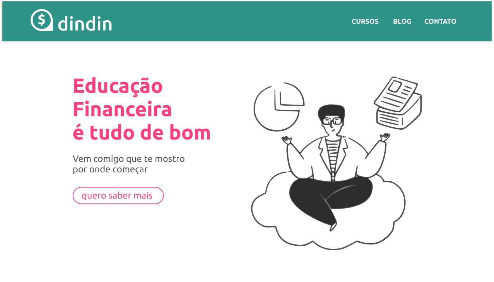

 

  

  <h3 align="center">Desafio Hacker Gama Experience - Grupo 22</h3>

  

    Dindin Soluções Financeiras
     
     
    <a href="https://github.com/raphaelandrews">Raphael Andrews</a>
    ·
    <a href="https://github.com/lucaslirac">Lucas Lira</a>
  

## Sobre o Projeto

Essa é a nossa resposta ao Desafio Hacker da Gama Academy que consiste em reproduzir interfaces em HTML e CSS a partir de um arquivo Figma. 

 

## Linguagens utilizadas

 

## Links
<h4>Raphael Andrews</h4>

[![LinkedIn][linkedin-shield]][linkedin-url]
[![GitHub][github-shield]][github-url]

<h4>Lucas Lira</h4>

[![LinkedIn][linkedin-shield]][linkedin-url2]
[![GitHub][github-shield]][github-url2]

[github-shield]: https://img.shields.io/badge/github-%23121011.svg?style=for-the-badge&logo=github&logoColor=white
[linkedin-shield]: https://img.shields.io/badge/linkedin-%230077B5.svg?style=for-the-badge&logo=linkedin&logoColor=white
[linkedin-url]: https://www.linkedin.com/in/raphael-andrews/
[github-url]: https://github.com/raphaelandrews
[linkedin-url2]: https://www.linkedin.com/in/lucas-coutinho-686377138/
[github-url2]: https://github.com/lucaslirac
